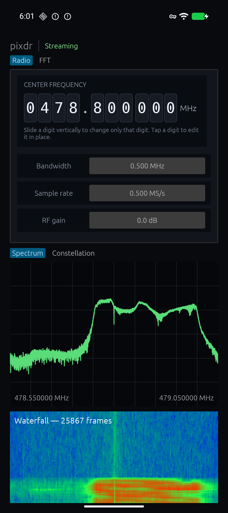
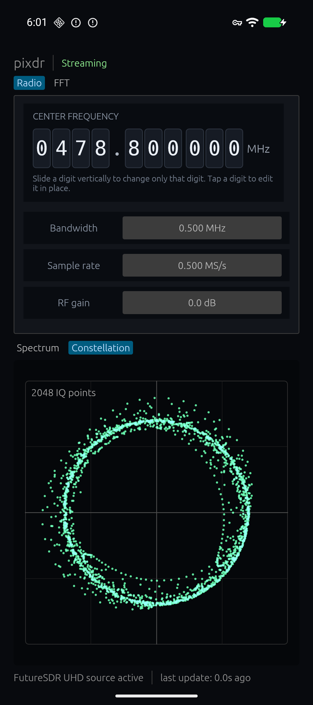
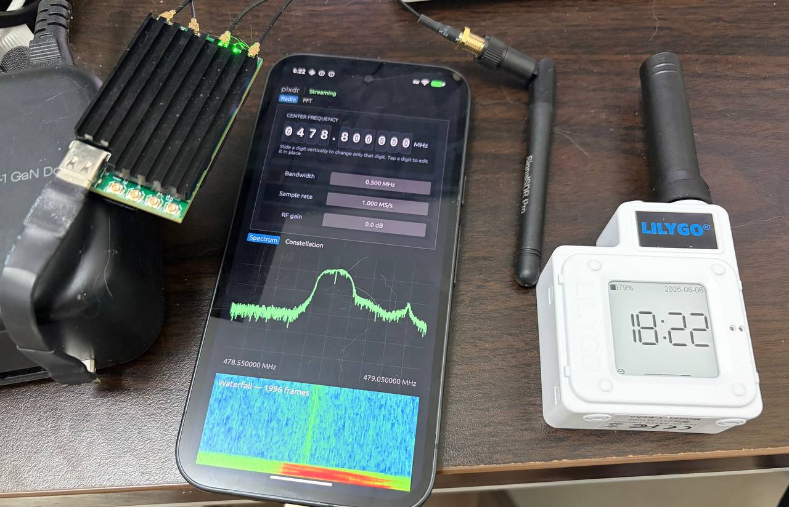

# pixdr

pixdr is a pure-Rust Android NativeActivity SDR app for using an Ettus/NI USRP B210 from an Android phone over USB host mode.

<p align="center">
  
  
  
</p>

Current target setup:

- Android NativeActivity, no Java/Kotlin app code
- Rust UI with `egui`/`eframe`/`wgpu`
- FutureSDR flowgraph backend with a custom UHD B210 source block
- UHD 4.10 built for Android arm64
- B200/B210 Android USB fd handoff flow inspired by GNU Radio's GrHardwareService
- B210 firmware/FPGA loading through UHD

## Repository layout

```text
pixdr/
  app/                    Rust NativeActivity app, AndroidManifest, assets, resources
  external/               External dependencies (git submodules in release)
    uhd/                  m4tsuri/uhd, branch pixdr-android-uhd-4.10
    libusb/               upstream libusb, tag v1.0.27
    uhd-rs/               m4tsuri/uhd-rust, branch pixdr-android
    boost-android/        m4tsuri/Boost-for-Android, branch pixdr-android
    FutureSDR/            FutureSDR runtime used for the receive flowgraph
  build/                  Generated native build/toolchain workspace (ignored)
  docs/                   Project notes and architecture notes
  patches/                format-patch exports of fork changes
  scripts/                Supported build/install/log entrypoints
```

Important app files:

- `app/src/lib.rs` — egui UI and B210 worker orchestration
- `app/src/futuresdr_backend.rs` — FutureSDR UHD source block and spectrum sink block
- `app/src/usb.rs` — Android USB permission and `UsbDeviceConnection` fd acquisition via JNI
- `app/src/uhd_wrapper.rs` — UHD init/open using injected Android USB context
- `app/AndroidManifest.xml` — NativeActivity declaration

## Prerequisites

Host tools:

- Linux host
- Android SDK with platform 29+ and build-tools 35.x
- Android NDK r27d extracted to `build/native/android-ndk-r27d` or provided via `PIXDR_NDK=/path/to/ndk`
- Rust nightly + `cargo-ndk`
- `cmake`, `make`, `wget`, `tar`, `zip`, `keytool`
- `adb`

Install Rust pieces:

```bash
rustup target add aarch64-linux-android
cargo install cargo-ndk
```

Android SDK defaults to `$HOME/Android/Sdk`. Override with:

```bash
export ANDROID_HOME=/path/to/Android/Sdk
```

## Checkout

```bash
git clone --recursive https://github.com/m4tsuri/pixdr.git
cd pixdr
```

If already cloned:

```bash
git submodule update --init --recursive
```

## Build

### 1. Build native dependencies from scratch

This builds Boost, libusb, and UHD into `build/native/toolchain/arm64-v8a`:

```bash
scripts/build-native.sh
```

This step is slow and assumes `external/` has been initialized with the pixdr fork branches plus upstream libusb.

### 2. Fetch B200/B210 runtime images

```bash
scripts/fetch-uhd-images.sh
```

This populates `app/assets/` with the three files packaged into the APK. They
are intentionally ignored by git until redistribution licensing is decided.

### 3. Build the APK

```bash
scripts/build-apk.sh
```

Output:

```text
app/pixdr-debug.apk
```

### 4. Install and run

```bash
scripts/install-run.sh
```

### 5. Follow logs

```bash
scripts/logcat.sh
```

## Fast rebuild during development

If native dependency build directories already exist:

```bash
scripts/rebuild-all.sh
```

This rebuilds native dependencies/UHD, builds the Rust app, packages the APK, installs it, and starts the app.

## Environment overrides

All scripts source `scripts/env.sh`. Useful overrides:

```bash
export ANDROID_HOME=/path/to/Android/Sdk
export PIXDR_NDK=/path/to/android-ndk-r27d
export PIXDR_ANDROID_API=29
export PIXDR_PREFIX=/path/to/android/uhd/prefix
```

## Android/B210 notes

Use a powered USB-C hub/dock. The B210 can brown out or fail to re-enumerate after FX3 firmware jump if powered directly from a phone.

Expected successful flow:

1. Android grants USB permission for the B210/FX3 device.
2. App obtains `UsbDeviceConnection` fd.
3. UHD loads FX3 firmware if needed.
4. Android re-enumerates the B210 as `Ettus Research LLC / USRP B200`.
5. App obtains a new fd.
6. UHD opens the B210 and loads FPGA.
7. A FutureSDR flowgraph runs a custom UHD B210 source block into the spectrum sink.
8. UI shows live FFT/waterfall when RX streamer is active.

If the UI says `B210 opened; RX stream failed`, UHD opened the device but RX streamer setup failed. Replugging or restarting the app is often enough while this Android USB path is still being hardened.

## Architecture notes

- Android USB context injection into UHD: `docs/android-uhd-injection.md`

## Fork branches

Patched dependencies are maintained as fork branches:

- `https://github.com/m4tsuri/uhd`, branch `pixdr-android-uhd-4.10`
- `https://github.com/m4tsuri/uhd-rust`, branch `pixdr-android`
- `https://github.com/m4tsuri/Boost-for-Android`, branch `pixdr-android`

Unpatched dependency:

- `https://github.com/libusb/libusb`, tag `v1.0.27`

`patches/` contains `git format-patch` exports for review/auditing.
